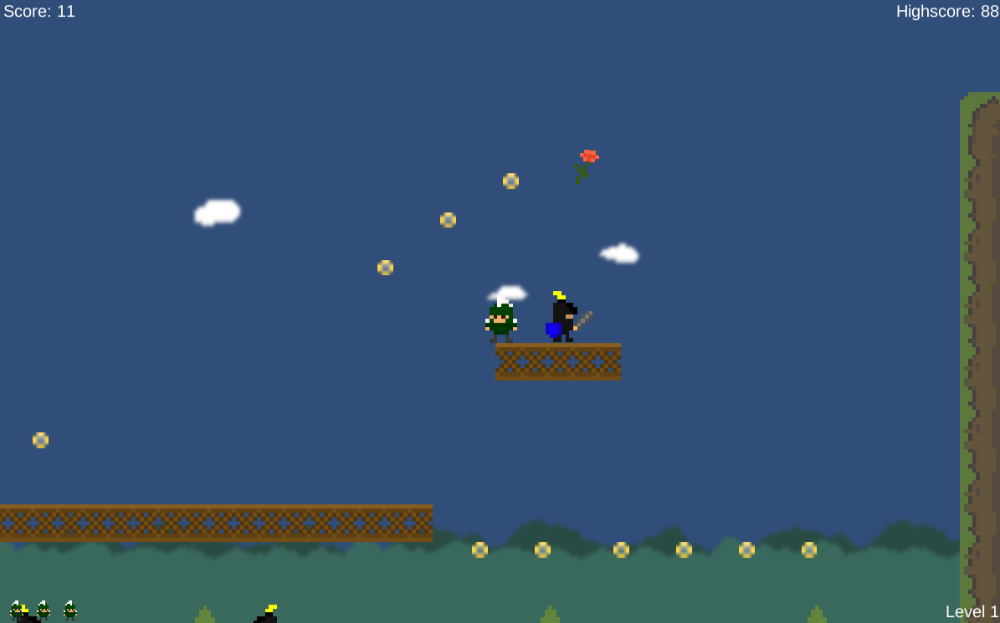
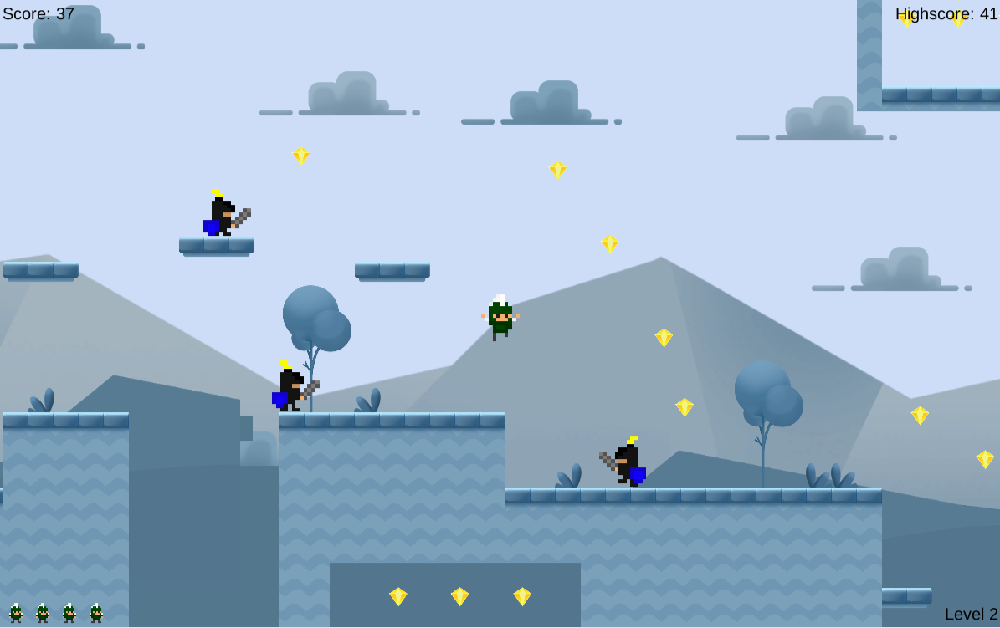

# Super Sparty Bros.
Coursera Unity Game Project  
Created by ___Lanz___  
Credited to Brian Winn and Greg Kozma  
© Michigan State University  
[Click to play](https://lanzzzzz.github.io/Unity_Platform-game/)

---

* Instructions:
  + Collect coins, avoid or bounce on enemies, and go for the Rose!
* Controls:
  + Keyboard = WASD or arrow keys to navigate and SPACE to jump
  + XBox360 Controller = Left-analog to navigate and A button to jump
* Significant Modification:
  + Brand new level 2
  + ___Secret Paths___ leading to more coins or even shortcuts to the victory!
  + New environment assets
  + New Coins 
  + Extra life every 10 points
  + Extra life animation and sound effect
  + New portal script redirecting the player to the final scene 
* Screenshot: 

# 
Thank you for [playing](https://lanzzzzz.github.io/Unity_Platform-game/)!!!

